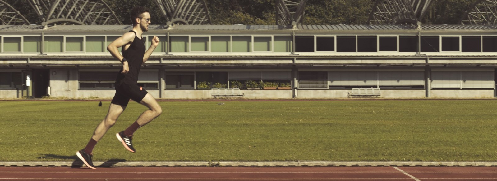
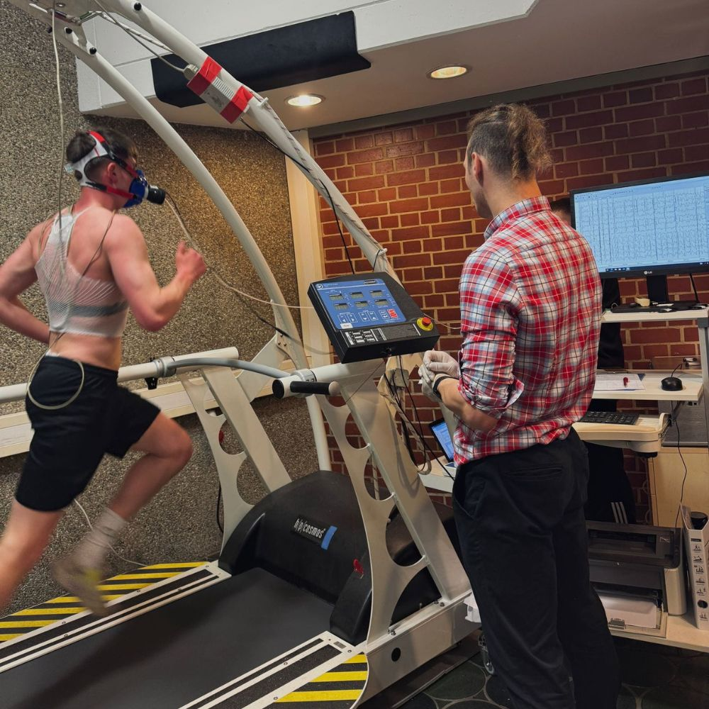
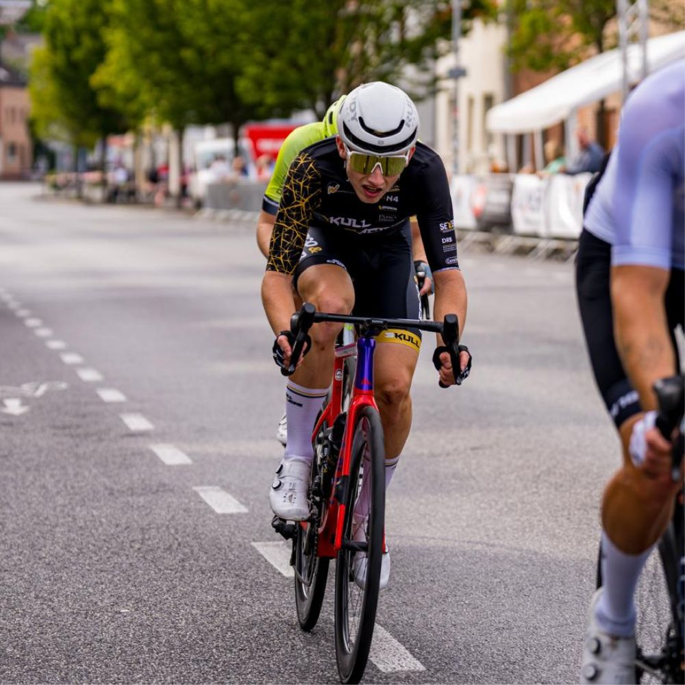
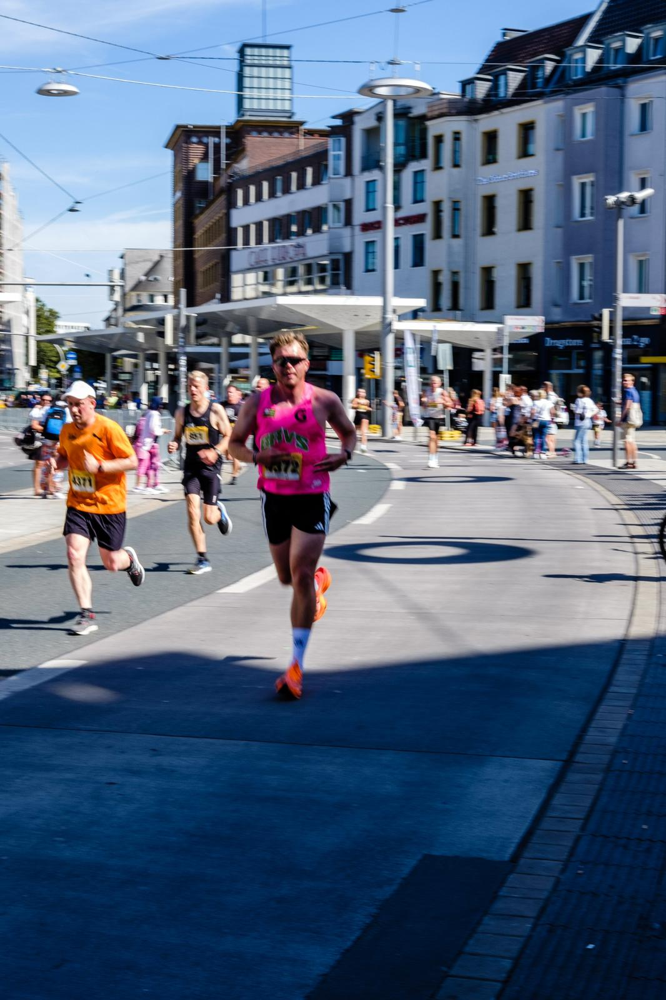
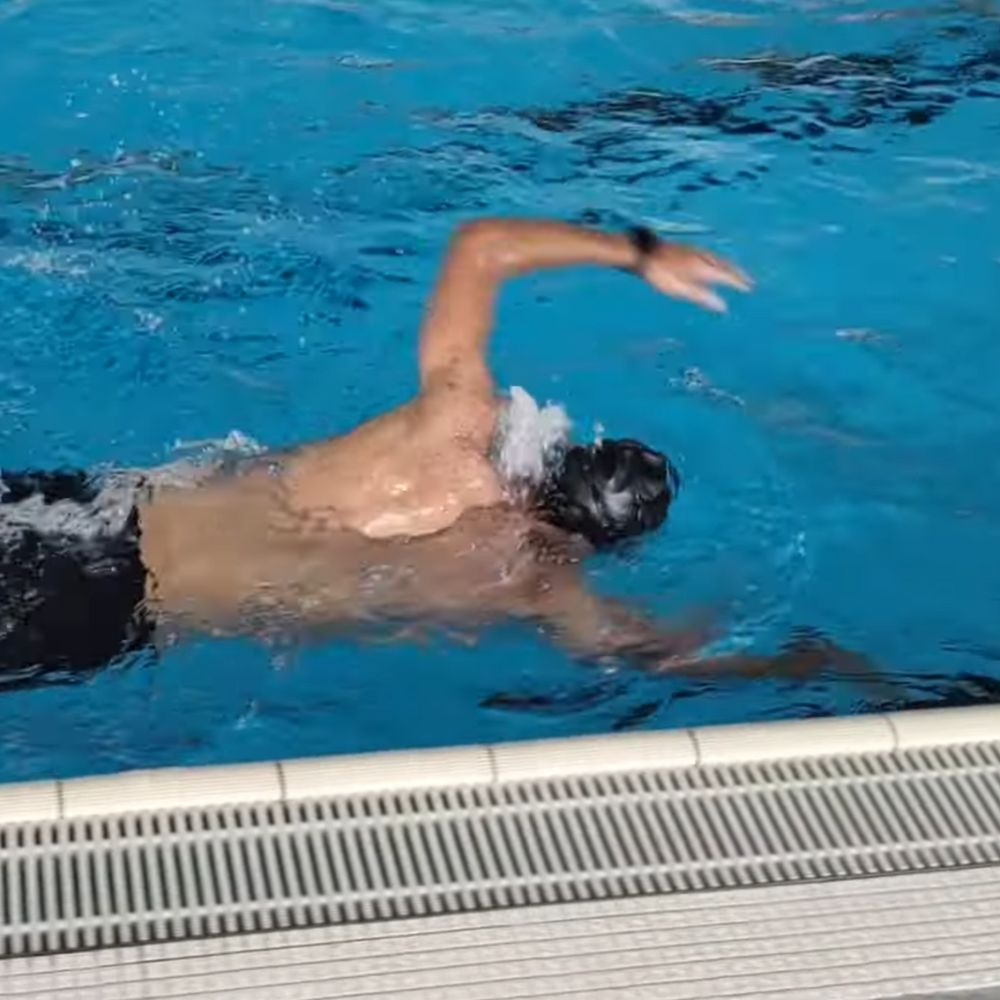



{.img-fluid .rounded}

### Performance Coaching for Ambitious Endurance Athletes {.bg-light}

Do you have ambitious athletic goals and want structured, professional coaching?  

I help endurance athletes **train more effectively, make faster progress, and improve sustainably**.  

You bring the motivation and goals – I take care of planning, analysis, and training management. From individual training plans to performance testing and swimming technique coaching.

::: text-center
[🎓 Explore Coaching Packages Now](/coaching/en.qmd#packages){.link-box-acc}
:::

::::: {.grid .bg-accent}
::: {.g-col-12 .g-col-md-6}
### Science Meets Practice

My coaching combines **current sports science with real-world coaching experience**.  

Your training is structured, regularly analyzed, and adapted based on your progress. Performance tests and data from your training make improvements visible.

::: text-center
[Go Directly to the Offers ⬇️](/coaching/en.qmd#packages){.link-box-acc}
:::
:::

::: {.g-col-12 .g-col-md-6}
{.img-fluid .rounded width=70%}
:::

:::::

::: {.bg-highlight}
### Testimonials 

What athletes say about working together:

::::::::::::::::::::: {#carouselExampleControls .carousel .slide data-bs-ride="carousel" data-bs-interval="6000"}
::: carousel-indicators
<button type="button" data-bs-target="#carouselExampleControls" data-bs-slide-to="0" class="active" aria-current="true" aria-label="Testimonial 1">

</button>

<button type="button" data-bs-target="#carouselExampleControls" data-bs-slide-to="1" aria-label="Testimonial 2">

</button>

<button type="button" data-bs-target="#carouselExampleControls" data-bs-slide-to="2" aria-label="Testimonial 3">

</button>

<button type="button" data-bs-target="#carouselExampleControls" data-bs-slide-to="3" aria-label="Testimonial 4">

</button>
:::

::::::::::::::::::: carousel-inner
:::::: {.carousel-item .active}
::::: {.card-testimonial .mx-auto style="max-width: 500px;"}

"From amateur to national cycling league – thanks to science-based training!"

:::: testimonial-author

<strong>Laurenz Fery</strong>  Cyclist  - Scull Racing Team

::::
:::::
::::::

:::::: carousel-item
::::: {.card-testimonial .mx-auto style="max-width: 500px;"}

"With the tailored plan, I got closer to my goals – even with a busy schedule."

:::: testimonial-author

<strong>Matti Hoth</strong>  Triathlete

::::
:::::
::::::

:::::: carousel-item
::::: {.card-testimonial .mx-auto style="max-width: 500px;"}

"Great training plan, excellent coach – guided me safely and motivated me to reach my marathon goal."

:::: testimonial-author

<strong>Maximilian Heinrich</strong>  Runner

::::
:::::
::::::

:::::: carousel-item
::::: {.card-testimonial .mx-auto style="max-width: 500px;"}

„I couldn’t swim at all – thanks to Philip I now master all four strokes with proper technique and water feeling.“

:::: testimonial-author

<strong>Aladdin Gomaa</strong>  Hobby Swimmer

::::
:::::
::::::
:::::::::::::::::::

:::::::::::::::::::::

::: text-center
[Book a Free Intro Session](/coaching/en.qmd#contact-me){.link-box}
:::
:::

::::: {.grid .bg-light}
::: {.g-col-12 .g-col-md-6}
{.img-fluid .rounded  width=70%}
:::

::: {.g-col-12 .g-col-md-6}
### Individual Focus: It's Your Path

I work exclusively in 1:1 coaching – your training is always individually tailored. We plan each session to fit your schedule and goals. If something changes – a sudden work commitment or illness – we adjust your training so you stay consistent.  

Through a digital training platform ([intervals.icu](https://intervals.icu)) you receive precise metrics on pace, power, or heart rate. I analyze each session and provide feedback – to make your training really work.

::: text-center
[Learn More About My Philosophy](/about%20me/en.qmd){.link-box}
:::

:::
:::::

### What You Gain from Coaching {.bg-gray}

<i class="bi bi-calendar3-week fs-4 me-2"></i> **More Structure & Efficiency** – train deliberately instead of randomly

<i class="bi bi-heart-pulse fs-4 me-2"></i> **Holistic Approach** – training, recovery, and everyday life in harmony 

<i class="bi bi-people fs-4 me-2"></i> **Motivation & Support** – I’m by your side even when it gets tough 

<i class="bi bi-graph-up fs-4 me-2"></i> **Scientifically Based Control** – every session has a clear purpose

<i class="bi bi-person-bounding-box fs-4 me-2"></i> **Individual Attention** – your training adapts to your life, not the other way around 

## Services {.bg-light}

:::::::: grid
::: {.g-col-12 .g-col-md-6 .g-col-lg-4 .card-leistung}
#### **Training Plans**

Individual plans for your goal – running, cycling, or triathlon. I continuously adapt your plan to your life and progress.
:::

::: {.g-col-12 .g-col-md-6 .g-col-lg-4 .card-leistung}
#### **Swim-Coaching**

Technique training in swimming – optional video analysis. Together we optimize your stroke and efficiency.
:::

::: {.g-col-12 .g-col-md-6 .g-col-lg-4 .card-leistung}
#### **Performance Testing**

Assess your fitness and training zones – remotely or in person. Receive precise data to optimize training and measure progress.
:::

::: {.g-col-12 .g-col-md-6 .g-col-lg-4 .card-leistung}
#### **Bike Fitting**

Your position affects comfort and performance. We optimize your setup for efficiency and injury prevention.
:::

::: {.g-col-12 .g-col-md-6 .g-col-lg-4 .card-leistung}
#### **Expert Consulting**

Questions about training, sleep, or recovery? Solve them in a 30-60 min session to help you progress.
:::
::::::::

## Packages {.bg-gray}

:::::: grid
::: {.g-col-12 .g-col-md-6 .g-col-lg-4 .card-package}
#### "Essential"

**€100 per month**

<i class="bi bi-check-square fs-4 me-2"></i> Monthly training plan

<i class="bi bi-check-square fs-4 me-2"></i> Monthly video or phone call

<i class="bi bi-check-square fs-4 me-2"></i> Unlimited communication via training platform

<i class="bi bi-check-square fs-4 me-2"></i> Progress tracking and analysis
:::

::: {.g-col-12 .g-col-md-6 .g-col-lg-4 .card-package}
#### "Premium"

**200€ pro Monat**

<i class="bi bi-patch-check fs-4 me-2"></i> Weekly training plan

<i class="bi bi-patch-check fs-4 me-2"></i> Weekly calls, dynamic adjustments

<i class="bi bi-patch-check fs-4 me-2"></i> Unlimited platform communication

<i class="bi bi-patch-check fs-4 me-2"></i> Customized analysis & progress tracking
:::

::: {.g-col-12 .g-col-md-6 .g-col-lg-4 .card-package}
#### Additional Services

**Price on request**

<i class="bi bi-dash"></i> Performance testing

<i class="bi bi-dash"></i> Coaching for professional athletes

<i class="bi bi-dash"></i> Bike fitting

<i class="bi bi-dash"></i> Swim coaching

<i class="bi bi-dash"></i> Individual consulting
:::
::::::

## Contact Me {.bg-light}

Ready to take your training to the next level?  

Let’s figure out how I can best support you.  

Book a **free introductory session** and we’ll discuss your goals, current training, and next steps.

<form
name="coaching-contact"
method="POST"
data-netlify="true"
action="../thank-you-en.html"
netlify-honeypot="bot-field">

<input type="hidden" name="form-name" value="coaching-contact">

    <label>
      Don’t fill this out if you’re human: <input name="bot-field" type="text" />
    </label>
  

  

<label>Your Name</label>
<input type="text" name="name" required
placeholder="Please enter your name">

<label>Email</label>
<input type="email" id="email" name="email"
placeholder="Please enter a valid email">

<label>Phone / WhatsApp</label>
<input type="tel" id="phone" name="phone"
placeholder="Please enter a valid phone number">

<label>Preferred Contact Method</label>

<label>
<input type="checkbox" name="contact_method" value="email" class="contact-option">
Email
</label>

<label>
<input type="checkbox" name="contact_method" value="whatsapp" class="contact-option">
WhatsApp
</label>

<label>
<input type="checkbox" name="contact_method" value="phone" class="contact-option">
Phone
</label>

<label>Message</label>
<textarea
name="message"
rows="4"
placeholder="Briefly describe yourself and your goals"
required></textarea>

    <button type="submit">Send Request</button>

</form>

