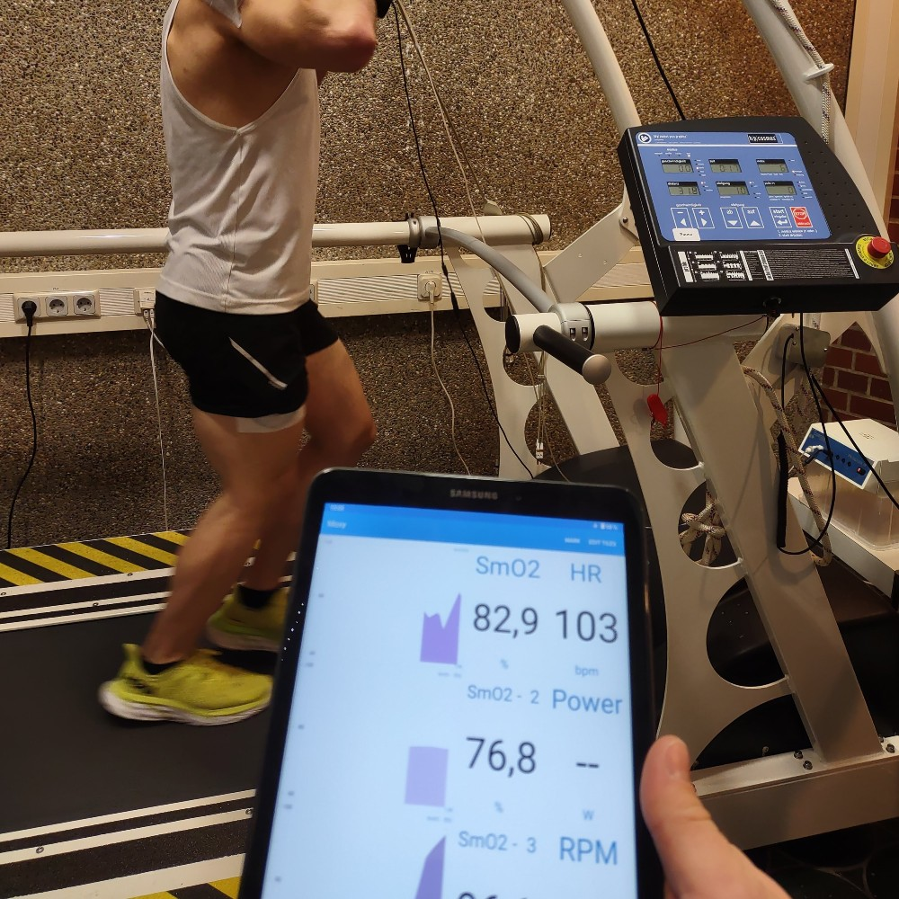
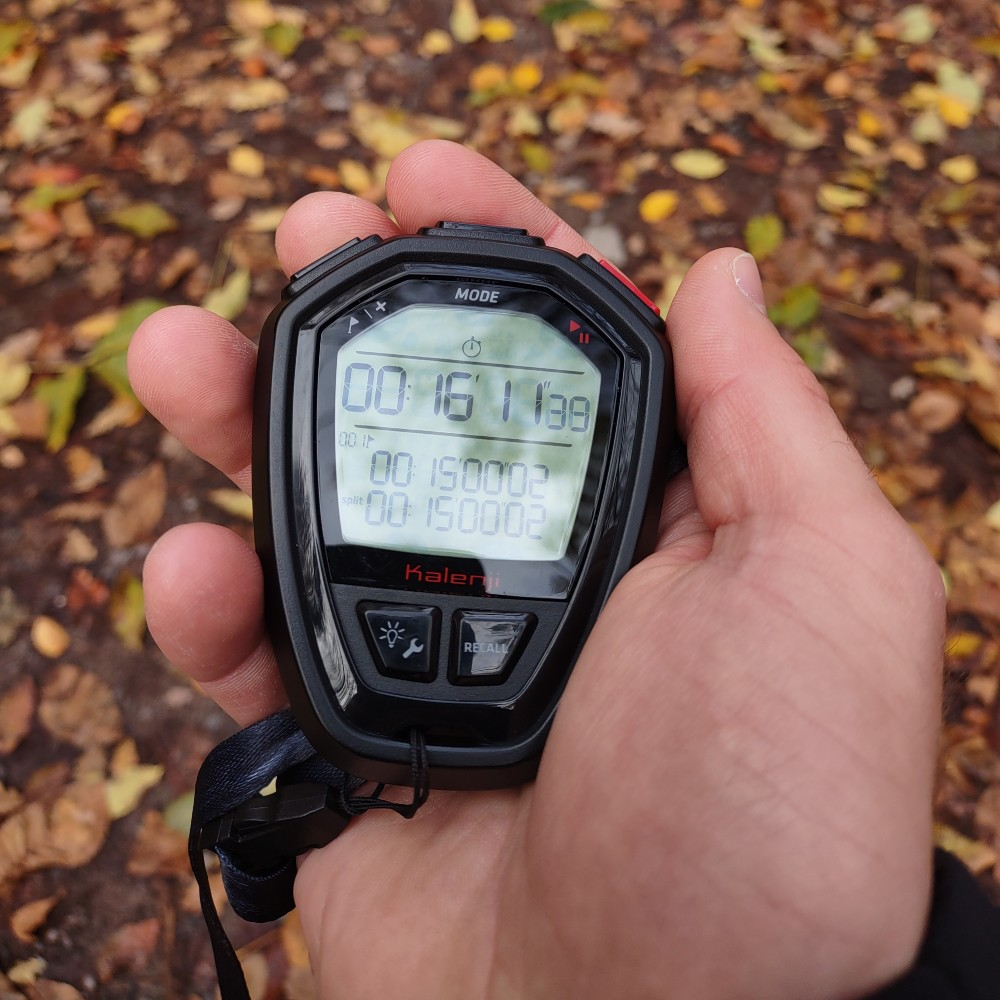
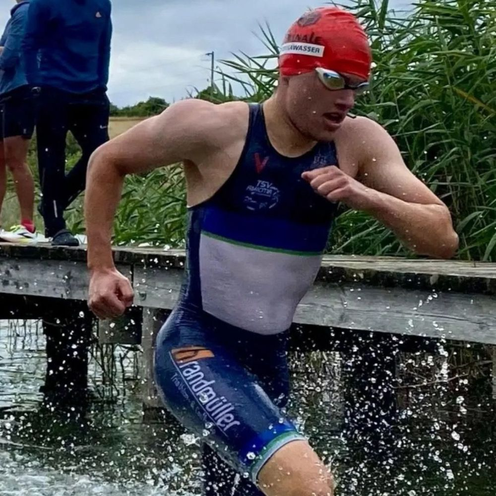
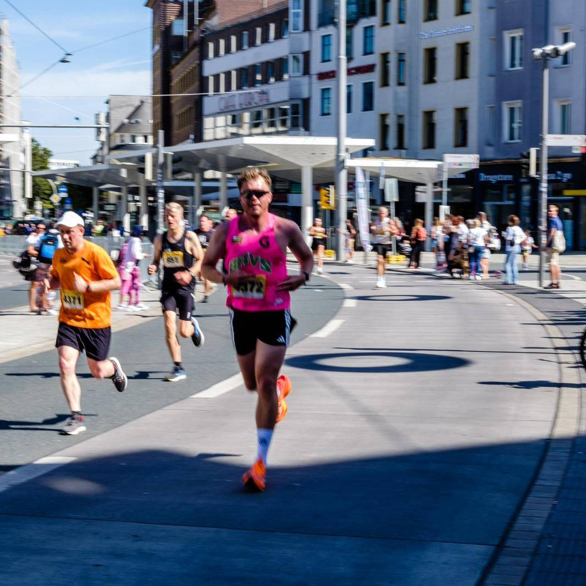

{.img-fluid .rounded}

### Ausdauertraining, das zu dir passt {.bg-light}

Du hast ein sportliches Ziel und suchst professionelle Begleitung?

Egal ob Einsteiger, erfahrener Athlet oder Profi – ich bringe die Erfahrung und das Know-how mit, um dich auf deinem Weg zu unterstützen und das Beste aus dir herauszuholen.

Du brinst deine eigenen Voraussetzungen mit - und ich übernehme die Trainingsplanung, begleite dich im 1:1 Coaching, führe mit dir eine Leistungsdiagnostik durch oder helfe dir, deine Kraul-Schwimmtechnik zu verbessern. So kannst du dein Training gezielt steuern und deine Ziele effizient erreichen.

::::: {.grid .bg-accent}
::: {.g-col-12 .g-col-md-6}
### Wissenschaft trifft auf Praxis

Als Sportwissenschaftler weiß ich, wie effektives Training funktioniert und integriere kontinuierlich neue wissenschaftliche Erkenntisse in die Praxis. Ich arbeite strukturiert und zielorientiert, und passe das Training an deine individuellen Stärken und Schwächen an. Mit regelmäßigen Leistungskontrollen stellen wir sicher, dass du Fortschritte machst – und reagieren, wenn es einmal nicht nach Plan läuft.

Gleichzeitig weiß ich aus meigener Erfahrung als Coach und Athlet: Das Leben hält sich nicht an Trainingspläne. Ob Stress im Alltag oder eine Erkältung - entscheidend ist, flexibel zu bleiben. Mit meiner mehrjährigen Praxiserfahrung helfe ich dir, das Training so zu gestalten, dass es zu deinem Leben passt - und du langfristig dranbleibst.
:::

::: {.g-col-12 .g-col-md-6}
{.img-fluid .rounded}
:::
:::::

::::: {.grid .bg-light}
::: {.g-col-12 .g-col-md-6}
{.img-fluid .rounded}
:::

::: {.g-col-12 .g-col-md-6}
### Individualität im Fokus: Es ist dein Weg

Ich arbeite ausschließlich im 1:1 Coaching – dein Training ist also immer individuell auf dich abgestimmt. Gemeinsam planen wir jede Einheit so, dass sie zu deinem Alltag und deinen Zielen passt. Wenn sich etwas ändert – ein spontaner Termin auf der Arbeit oder eine Erkältung – passen wir dein Training flexibel an, damit du kontinuierlich dranbleiben kannst.

Über eine digitale Trainingsplattform ([intervals.icu](https://intervals.icu)) erhälst du präzise Vorgaben zu Pace, Watt oder Herzfrequenz. Deine Sportuhr synchronisiert automatisch, sodass ich jede Einheit analysieren und gezieltes Feedback geben kann – für dein bestes Training, jederzeit.
:::
:::::

::: text-center
[Erfahre mehr über meine Philosophie](/about%20me/index.qmd){.link-box}
:::

### Was du mit meinem Coaching erreichst: {.bg-gray}

<i class="bi bi-calendar3-week fs-4 me-2"></i> **Mehr Struktur & Effizienz** - du trainierst gezielt statt zufällig

<i class="bi bi-heart-pulse fs-4 me-2"></i> **Ganzheitliche Ansatz** - Training, Regeneration & Alltag im Einklang

<i class="bi bi-people fs-4 me-2"></i> **Motivation & Unterstüztung** - ich bin an deiner Seite, auch wenn's mal schwerfällt

<i class="bi bi-graph-up fs-4 me-2"></i> **Wissenschaftlich fundierte Steuerung** -jedes Training hat einen klaren Zweck

<i class="bi bi-person-bounding-box fs-4 me-2"></i> **Individuelle Betreuung** - dein Training passt sich deinem Leben an, nicht umgekehrt

### Stimmen aus dem Coaching {.bg-highlight}

Was Athlet\*innen über die Zusammenarbeit sagen:

::::::::::::::::::::: {#carouselExampleControls .carousel .slide data-bs-ride="carousel" data-bs-interval="6000"}
::: carousel-indicators
<button type="button" data-bs-target="#carouselExampleControls" data-bs-slide-to="0" class="active" aria-current="true" aria-label="Testimonial 1">

</button>

<button type="button" data-bs-target="#carouselExampleControls" data-bs-slide-to="1" aria-label="Testimonial 2">

</button>

<button type="button" data-bs-target="#carouselExampleControls" data-bs-slide-to="2" aria-label="Testimonial 3">

</button>

<button type="button" data-bs-target="#carouselExampleControls" data-bs-slide-to="3" aria-label="Testimonial 4">

</button>
:::

::::::::::::::::::: carousel-inner
:::::: {.carousel-item .active}
::::: {.card-testimonial .mx-auto style="max-width: 500px;"}

"Vom Amateur in die Rad-Bundesliga - dank Wissenschafts-basiertem Training!"

:::: testimonial-author

<strong>Laurenz Fery</strong>  Radfahrer - Scull Racing Team

::::
:::::
::::::

:::::: carousel-item
::::: {.card-testimonial .mx-auto style="max-width: 500px;"}

"Ich habe mein Training endlich strukturiert und erreiche konstant Fortschritte. Absolut empfehlenswert!"

:::: testimonial-author

<strong>Matti Hoth</strong>  Triathlet

::::
:::::
::::::

:::::: carousel-item
::::: {.card-testimonial .mx-auto style="max-width: 500px;"}

"Super Trainingsplan, top Coach – hat mich sicher und motiviert zu meinem Marathonziel gebracht."

:::: testimonial-author

<strong>Maximilian Heinrich</strong>  Läufer

::::
:::::
::::::

:::::: carousel-item
::::: {.card-testimonial .mx-auto style="max-width: 500px;"}

„Ich konnte gar nicht schwimmen – dank Philip beherrsche ich jetzt alle vier Lagen mit sauberer Technik und gutem Wassergefühl.“

:::: testimonial-author

<strong>Aladdin Gomaa</strong>  Hobby-Schwimmer

::::
:::::
::::::
:::::::::::::::::::

:::::::::::::::::::::

## Leistungen {.bg-light}

:::::::: grid
::: {.g-col-12 .g-col-md-6 .g-col-lg-4 .card-leistung}
#### **Trainingsplanung**

Individuelle Trainingspläne für dein Ziel - egal ob Laufen, Radfahren oder Triathlon. Ich begleite dich kontinuierlich und passe das Training flexibel an dein Leben und deine Fortschritte an.
:::

::: {.g-col-12 .g-col-md-6 .g-col-lg-4 .card-leistung}
#### **Schwimm-Coaching**

Techniktraining im Schwimmen - auf Wunsch mit Videoanalyse. Gemeinsam optimieren wir deinen Schwimmstil und machen dich effizienter im Wasser.
:::

::: {.g-col-12 .g-col-md-6 .g-col-lg-4 .card-leistung}
#### **Leistungsdiagnostik**

Bestimme deine Trainingsbereiche und Leistungsfähigkeit - remote oder vor Ort. Mit dem für dich passenden Test bekommst du präzise Werte, um dein Training optimal zu steuern und Fortschritte zu messen.
:::

::: {.g-col-12 .g-col-md-6 .g-col-lg-4 .card-leistung}
#### **Bikefitting**

Deine Sitzposition entscheidet über Komfort und Leistung. Wir analysieren und optimieren dein Setup, damit du effizient und beschwerdefrei trainieren kannst.
:::

::: {.g-col-12 .g-col-md-6 .g-col-lg-4 .card-leistung}
#### **Experten-Beratung**

Ob Training, Schlaf oder Erholung – in einem 30- oder 60-minütigen Gespräch klären wir deine Fragen und finden Lösungen, die dich weiterbringen.
:::
::::::::

## Pakete und Leistungen {.bg-gray}

:::::: grid
::: {.g-col-12 .g-col-md-6 .g-col-lg-4 .card-package}
#### "Essential"

**100€ pro Monat**

<i class="bi bi-check-square fs-4 me-2"></i> Monatliche Trainingsplanung

<i class="bi bi-check-square fs-4 me-2"></i> Monatlicher Video- oder Telefon-Call

<i class="bi bi-check-square fs-4 me-2"></i> Unbegrenzte Kommunikation über Trainingsplattform

<i class="bi bi-check-square fs-4 me-2"></i> Trainingsanalyse und Fortschrittskontrolle
:::

::: {.g-col-12 .g-col-md-6 .g-col-lg-4 .card-package}
#### "Premium"

**200€ pro Monat**

<i class="bi bi-patch-check fs-4 me-2"></i> Wöchentliche Trainingsplanung

<i class="bi bi-patch-check fs-4 me-2"></i> Wöchentliche Calls, dynamische Plananpassung

<i class="bi bi-patch-check fs-4 me-2"></i> Unbegrenzte Kommunikation über Trainingsplattform

<i class="bi bi-patch-check fs-4 me-2"></i> Individuelle Trainingsanalyse und Fortschrittskontrolle
:::

::: {.g-col-12 .g-col-md-6 .g-col-lg-4 .card-package}
#### Weitere Leistungen

**Preis auf Anfrage**

<i class="bi bi-dash"></i> Schwimm-Coaching

<i class="bi bi-dash"></i> Leistungsdiagnostik

<i class="bi bi-dash"></i> Bikefitting

<i class="bi bi-dash"></i> Individuelle Beratung
:::
::::::

## Kontaktiere Mich {.bg-light}

Bereit dein Training aufs nächste Level zu bringen?

Dann lass uns gemeinsam herausfinden, wie ich dich am besten unterstützen kann. 

Buche ein **kostenloses Erstgespräch**, und wir besprechen deine Ziele, dein aktuelles Training und die nächsten Schritte.

