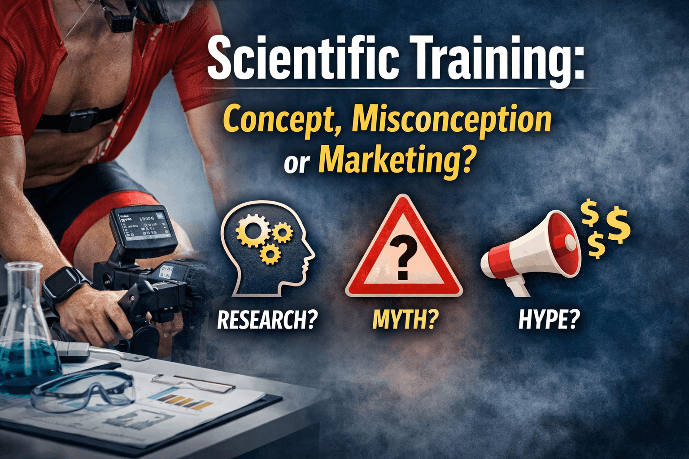

{.img-fluid .rounded}

Hi, this is Philip on Performance Science^2^. In my first blog post I will dive into the idea of **scientific training** - and why the term is misperceived and exploited.

## Motivation

> *In 2023, Australian triathlete Max Neumann won the men's PTO European Open race. In the post race interview he made fun of his Norwegian competitors by attributing his victory to his "**no bullshit science**" approach* ([video](https://www.youtube.com/shorts/gkhg09N305A))*. Indeed, the Norwegian triathletes are famous for collecting tons of data. Often this extensive monitoring program is characterized as **scientific training**.*

Maybe the Norwegians never claimed to do scientific training themselves. Yet, Neumann's quote reflects a broader belief: There is something like *scientific training*.

But does it actually exist?

Before we can answer this question, we need to understand what science is.

## What is science?

You may be surprised to read that even scientists don't agree on a clear definition of science. Aspects found in many definitions are:

-   Science is a system, structured in organizations following common practices
-   Science aims to generate generalizable^[Note: In some scientific discplines, especially in the social sciences, generalizability is not necessarily the goal] knowledge
-   Science tests hypotheses generated from prior knowledge
-   Science uses specialized methods

### Where training looks scientific

There are some parallels to what is considered *scientific training* in sports:

-   **Technology use** - While some technology is well-established (e.g heart rate sensors and power meters), novel devices such as core temperature sensors or muscle oxygenation monitors are becoming used more frequently. This trend originates in the democratization of knowledge and ongoing *technology transfer*.
-   **Personalized insights** *-* technology is used to understand the athlete's training and recovery response in real world conditions.
-   **Precise training control** - the insights are then used to execute training sessions and maximize adaptation while minimizing recovery need.

### Where it fundamentally differs

Next to these similarities there are some key differences:

Training usually does not aim to generate knowledge applicable beyond a single athlete. When done right, technology can be used to understand how *one* athlete handles training sessions and adapts to that stimulus. However, training is performed in changing environments (e.g. hot summer day versus mild spring), complicating generalizability.

Once we acknowledge that athletes respond differently to training, it becomes difficult to generate new knowledge that extends beyond one athlete.

In training hypotheses are not tested, at least in a scientific sense. Smart coaches and athletes can use technology to test if a new training method results in performance gains. The difference is the lack of strictly controlled experimental conditions to investigate the causal effect of a *single variable*.

When preparing for a competition many variables of the training program are changed at once: Nutrition is optimized and combined with different interval sessions, all while doing an altitude training block.

Consequently, the coach and athlete learns that this *combination* works.

But the contribution of each variable remains unknown.

As demonstrated, training can approximate and *mimic* scientific principles. This assumes that the coach-athlete team really is using the data *meaningfully* to form hypotheses on training responses and critically evaluates them.

Training builds an *implicit* understanding of the athlete.

Science, however, at its core aims to identify *explicit* cause-effect relationships.

> If training cannot truly be scientific in a strict sense, then why is the term used so frequently?

Coaches posting fancy-looking social media content and boasting about being scientific is often- at least in part - a **marketing claim**.

## The Marketing Power of "Science"

Outside universities and research institutions, the term science is often used and exploited as a marketing claim. It transfers the idea of trustworthiness, truth and being smart. It creates the illusion of expertise, especially when combined with fancy devices to collect data, colorful graphs and scientific-sounding but insubstantial language.

Data is not understanding.

The real problem, however, runs deeper. Those coaches who advertise their services commonly present single research studies with 10 participants as *proof* that a training method is optimal. Case-reports or non-peer reviewed articles or blog posts are treated as scientific evidence. 

This blurs the line between real evidence and pseudo-science.

It is this superficial credibility and affirmation of "optimal" solutions conveyed when using the term science that attracts athletes looking to improve.

The danger? The athlete will be charged a premium for a false promise.

> Science does not make a training plan optimal or a coach better than others.

This is not how the scientific method works.

Of course, there *are* coaches that do amazing work with athletes, translate research findings into their craft and incorporate data to monitor progress and make adjustments. But they don't need to throw around the term science to market themselves.

## Merging Science and Practice

In essence, science is defined by specific characteristics that differ vastly from real coaching practice. However, these two worlds do not only exist in parallel but can learn from each other:

-  The researcher observes what athletes are doing and aims to understand it from a physiological, biomechanical, psychological or socio-economic perspective.
-  Coaches and athletes take knowledge generated by science and apply it to a training program.

> Together sport science and applied practice can form a strong synergy.

## Summary

We discovered that there is no such thing as *scientific* training. Still, we can leverage science in the training process.

As a coach as well as sport scientist and active researcher myself, I try to do exactly this. I read the scientific literature. I use tools to measure data in the field. But I also know that data can be noisy, incomplete or misleading. Performance and athlete success go beyond what gadgets can capture.

On my ongoing quest to improve as a coach, I strive to transfer new knowledge from science to practice, measure data with athletes when appropriate and combine it with my observations as a coach to help my athletes to improve and reach their goals. Holistically.

***
So if training itself is not scientific, what does it actually mean to coach with science?

In a future blog post I will expand this discussion and explore what the terms evidence-based and evidence-informed really mean - and why they are often misunderstood in coaching as well.